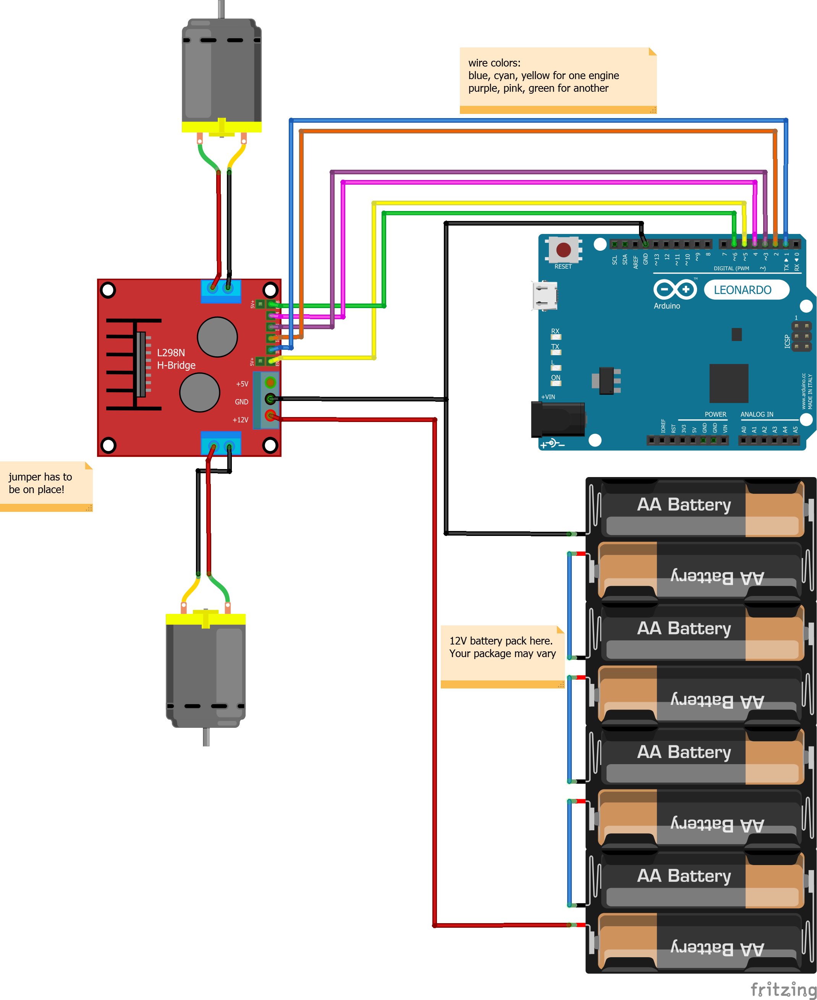

YolkaBot
========
Cheap'n'simple telepresence bot with Arduino, win/linux laptop and cross-platform remote control apps

Description
-----------
If you want a friend to attend your new year party while he's in another country, build a telepresence bot! It's much better than plain Skype conversation because your friend can control the bot and ride around ~~causing some mess~~ and it actually feels like he's with you in the same room, not behind the screen.

|Building        |Completed       |Some swag added |
|----------------|----------------|----------------|
||||
|Those wires are temporary|Note the USB stick. My HDD suddenly died and i'm running live Manjaro Linux from the USB. Only needed to install a couple of packages.|It was our "christmas tree" actually because we didn't bother to bring a real one. TODO: add LEDs!|

Features
--------
* Simple building and low cost of materials (if you have a laptop already)
* No electronic cirquit design skills required (well, you'll have to understand school basics and solder a couple of wires, actually)
* Works with any Windows or Linux laptop (better if you are not afraid if it falls from 1.5 meters height)
* Can be controlled by
  * Keyboard (Windows, Linux)
  * Gamepad with two sticks (Windows, Linux)
  * Android
* Multiple simultaneous clients supported (so you can make conference call in Skype and see your friends fighting for control!)

Instructions
--------

+ [Chassis](#chassis)
+ [Electronics](#electronics)
  - [Circuitry](#circuitry)
  - [Server? Clients?](#server--clients-)
+ [Code](#code)
  - [Prerequisites](#prerequisites)
  - [Dependencies](#dependencies)
  - [Building](#building)
  - [Debugging](#debugging)
+ [Usage](#usage)
  - [Arduino](#arduino)
  - [Server](#server)
  - [Desktop client](#desktop-client)
  - [Android client](#android-client)
  - [Bugs, limitations](#bugs--limitations)
  - [Notes](#notes)
+ [Bypassing NAT if you're running bot in a random location](#bypassing-nat-if-you-re-running-bot-in-a-random-location)
* [What's "Yolka"?](#what-s--yolka--)
* [Credits](#credits)

### Chassis

Materials used (no prices because they were in ₽):
* 3 aluminium tubes for triangle stand
* 1 particleboard shelf for base
* 2 lawnmower wheels (and motors, see below)
* 1 shopping cart wheel (with rotating mount)
* Electrical tape, cable ties, screws
* 1 Tiny piece of wood about 5x5x5 cm

The main idea is to make the stable triangle base, with 2 motored wheels and one supporting "shopping cart" wheel and then to empirically find gravity center for your laptop.

I had no idea how to attach wheels to motors and used epoxy glue. Don't do that! Find a better way... Then mount motors under the base, using cable ties threaded through holes. I also used some screws for better fixation. Mount the third wheel also. I was lucky and wheel heights matched each other's so i did not need to balance the base. Then use the hammer to flatten ends of two tubes, bend them and attach above motored wheels with screws. Cross the tubes and decide on what height you want to mount the laptop. Cut tubes slightly more than this length. After this attach the third tube above the third wheel and find the best length for it, keeping in mind that laptop is heavy and that you want to place center of gravity right in the middle of the base triangle. Finally, cut the last tube and connect them all using tiny piece of wood and screws. Test your structure with laptop attached and battery placed on the base and see if it is stable or not. 

### Electronics

Parts:
* 1 Arduino (i used Leonardo)
* 1 L298N Dual H Bridge DC Stepper Motor Controller Module
* 2 DC motors (see below for details)
* 1 UPS battery with voltage equal or above motors' voltage (i had 6V motors and 12V battery, see below). And a charger.
* Wires for Arduino (with connectors)
* Generic wires for battery and motors (thicker than Arduino's), plus 2 terminals to easily detach the battery
* Any laptop with WiFi, camera, free USB port and good battery
* Long USB cable to connect Arduino to laptop
* (optional) Portable speaker if your laptop's spaekers are not powerful enough

#### Circuitry

It's a good question how to determine which motors you need. Take into consideration: overall weight, wheels size, desired speed... And just buy the most powerful motors with the right RPM!

If your motors and battery have the same voltage, it's good. If your battery has lower voltage, you will underpower your motors. If your battery has more volts than motors require, like in my case, then you can set up the code so it will use only part of available power by limiting max PWM. See `PWM_MAX` const in `motor.cpp`. Maximum value is 255, so i set it to half to use 6V motors with 12V battery. Without this i'd burn them after some time.

#### Server? Clients?

Laptop will connect to network, run server part of the software and talk to Arduino by USB. Clients will connect to the server and send commands to control motors. You will need to make a video call with Skype or something else to let client see where they're going. So good WiFi is very recommended. The biggest problem is that camera usually points horizontally so the client won't see stuff under the wheels like chairs, pets, etc. If you are not at home and can not set up the network to make server port accessible from internet, see NAT section below.

### Code

#### Prerequisites
I used Arduino IDE, Visual Studio 2015 Community,  MonoGame and default Android emulator that ships with them. I'm not sure but looks like MonoGame also installed Xamarin automatically. All these tools are free. You can easily find them ~~and waste endless hours to install~~.

#### Dependencies
C# part of the project has normal NuGet dependencies so it just works. Arduino code has dependency on [CmdMessenger](http://playground.arduino.cc/Code/CmdMessenger) which can be installed in Arduino IDE package manager.

#### Building
I can't get Visual Studio to create .apk when building, so you need to run Deploy and locate .apk in bin folder.

#### Debugging
Default android emulator took me some time to set up. Just use google if you experience errors. Also if app does not start, manually unlock the screen in android and restart debugging.

### Usage

#### Arduino
Just upload the sketch. It looks stable and should work without manual resets.

#### Server
Connect Arduino to the laptop by USB and run server. **On Linux**: you will need `mono` package. Serial port access requires user to be a member of special group, or just run as root.

#### Desktop client
Use keyboard or any gamepad with two sticks. **On Linux**: there is a bug in MonoGame: it doesn't like genuine PS3 controllers, just crashes. Try another one or remap it with `xboxrdv`.
Keyoard controls:

|key|action|
|---|------|
|1|left motor forward 100%|
|Q|left motor forward 50%|
|A|left motor backward 50%|
|Z|left motor backward 100%|
|2|right motor forward 100%|
|W|right motor forward 50%|
|S|right motor backward 50%|
|X|right motor backward 100%|
|Esc|exit|
|Enter|makes bot listen to this client's commands|
|Space|forces motors to stop immediately|

#### Android client
Use two virtual sticks (**@** signs). **[ACTIVATE]** makes bot listen to this client's commands. **[STOP]** forces motors to stop immediately.

#### Bugs, limitations
It was quickly-written project so there are some dirty hacks and sometimes i experienced hangs, not sure on client or server side.

#### Notes

You will need to tweak the code here or there because it has some things hardcoded, most important:
* Network addresses in clients' `Program.Main` and `Activity1.OnCreate`
* Pins in `global.cpp`
* PWM limit (due to battery voltage in my case) and some other consts in `motor.cpp`

Traffic consumption should be very small because i send raw TCP packets and only when client changes input.

### Bypassing NAT if you're running bot in a random location
Server binds to TCP port and can work with multiple clients. If you take your YolkaBot to a random place, you might find yourself behind NAT. I bypassed it with SSH reverse port worwarding, but it requires a host with SSH access and pblicly available IP. You will need:
* hardcode that host's IP and desired port into clients
* set up SSHd (there are default security settings preventing reverse-bind on nonlocal IPs)
* use ssh -R on YolkaBot's laptop
* run Server and listen to port which is forwarded to by SSH.

With this setup, you need zero configuration on clients and you can simply restart server/ssh if something goes wrong.

What's "Yolka"?
---------------
*Ёлка* is the word for christmas tree in Russian.

Credits
-------

* Code, idea [vk.com/rast1234](https://vk.com/rast1234)
* Construction, organization [vk.com/jares13](https://vk.com/jares13)
* Motivation [vk.com/syrochkin](https://vk.com/syrochkin)
* VirtualGamepad is based on code by [user Aranda](http://community.monogame.net/t/any-alternative-on-virtual-joystick/2669)
* Scheme made with [Fritzing](fritzing.org) and custom [L298N part](https://github.com/yohendry/arduino_L298N)

[Feel free to ask questions or submit bugs](https://github.com/Rast1234/YolkaBot/issues) or PM me in English or Russian (link in credits)
